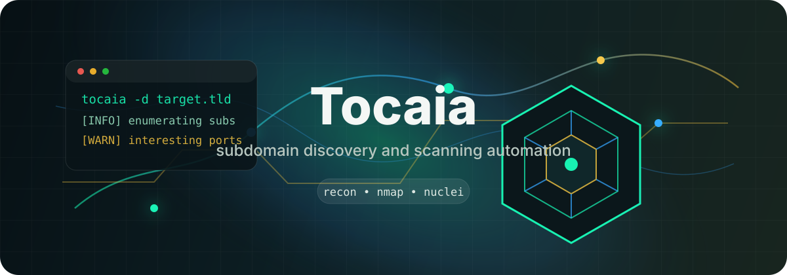

<p align="center">
  
</p>

<h1 align="center">Tocaia</h1>

<p align="center">
  
  <a href="mailto:ander2017@proton.me"></a>
  <a href="LICENSE"></a>
</p>

Lightweight bug bounty reconnaissance pipeline that automates discovery, validation, screenshots, port scanning, and vulnerability checks.

Use this only on targets you own or have explicit permission to test.

## Features

- Enumerates subdomains with any installed supported tool: `subfinder`, `assetfinder`, or `amass`.
- Normalizes and deduplicates discovered subdomains.
- Checks alive HTTP services with `httpx`.
- Captures screenshots with `eyewitness` when available.
- Scans ports with `nmap`.
- Runs HTTP nuclei templates with `nuclei`.
- Sends interesting-port notifications with `notify`.
- Supports concurrent scans for multiple domains.
- Can redirect application logs to a file with `--output-log`.

## Requirements

- Python 3.10 or newer
- `urllib3`
- At least one subdomain enumeration tool:
  - `subfinder`
  - `assetfinder`
  - `amass`
- Recommended external tools:
  - `httpx`
  - `nmap`
  - `nuclei`
  - `notify`
  - `eyewitness`

The scanner skips optional tools that are not installed where possible, but subdomain discovery requires at least one supported enumeration tool.

## Installation

Install it as an isolated command with `pipx`:

```bash
pipx install git+https://github.com/bern-out/Tocaia.git
```

Then run:

```bash
tocaia -d example.com
```

For local development, clone the repository and install it in editable mode:

```bash
git clone https://github.com/bern-out/Tocaia.git
cd tocaia
python3 -m venv .venv
source .venv/bin/activate
python3 -m pip install -e .
```

Install the external security tools with your preferred package manager or from each tool's official installation instructions.

## Usage

Scan a single domain:

```bash
tocaia -d example.com
```

Scan domains from a file:

```bash
tocaia -f domains.txt
```

Limit concurrent workers:

```bash
tocaia -f domains.txt --max-workers 5
```

Skip honeypot checks:

```bash
tocaia -d example.com --ignore-honeypot
```

Redirect application logs to a file:

```bash
tocaia -d example.com --output-log logs/tocaia.log
```

Short options are also available:

```bash
tocaia -d example.com -mw 5 -igh -o logs/tocaia.log
```

## Output

Tocaia writes scan output under:

```text
domains/<domain>/
```

Each run creates a timestamped JSON report:

```text
domains/<domain>/<YYYYMMDD_HHMMSS>.json
```

When `eyewitness` is installed, screenshots are written under:

```text
domains/<domain>/eyewitness/
```

## Notes

- `--output-log` redirects messages emitted by Tocaia's custom logger. Raw output from external tools is only included when the script captures and logs it.
- Full port scans are triggered when interesting ports are found.
- Notifications use `notify` with the configured ID `recon-lab`.

## License

This project is licensed under the MIT License. See [LICENSE](LICENSE).
